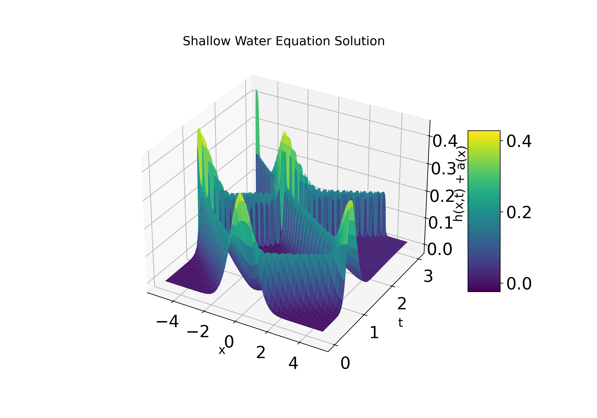

# 🌊 1D Shallow Water Equations
Welcome! This project is designed to create a configurable python class which can plug-and-play different numerical schemes under different bc's for the 1D shallow water equations.

---

## 1️⃣ Quick Start: Reproducing Results

If your concern is merely to reproduce the results from the report then the following command will reproduce every Figure.

```bash
# Clone the repository
git clone https://github.com/PatrickhCahill/shallow_water_modelling.git
cd shallow_water_modelling

# Install dependencies
# Optional: python -m venv vev; source venv/bin/activate
pip install -r requirements.txt

# Run the main script
python run_model.py
```

Note: By default behaviour the high-resolution Figure 4 will be disable as this takes approximately 2/3 minutes to execute. This can be readily enabled by setting `HIGH_RES_FIGURE_MUSCL_HYDROSTATIC=True` in `run_model.py`.

The relevant Figures produced in the report will be
- data/convergence_test_shallow_water_equations_T1.png
- data/convergence_test_shallow_water_equations_T3.png

- data/conv_test_btcs_T3/Nx101_Nt12001/energy_over_time.png
- data/conv_test_btcs_T3/Nx101_Nt12001/velocity_heatmap.png
- data/conv_test_btcs_T3/Nx101_Nt12001/height_heatmap.png

- data/conv_test_lax_T3/Nx101_Nt601/energy_over_time.png
- data/conv_test_lax_T3/Nx101_Nt601/velocity_heatmap.png
- data/conv_test_lax_T3/Nx101_Nt601/height_heatmap.png

- data/conv_test_muscl_hydrostatic_T3/Nx101_Nt12001/energy_over_time.png
- data/conv_test_muscl_hydrostatic_T3/Nx101_Nt12001/velocity_heatmap.png
- data/conv_test_muscl_hydrostatic_T3/Nx101_Nt12001/height_heatmap.png

- data/conv_test_symplectic_T3/Nx101_Nt12001/energy_over_time.png
- data/conv_test_symplectic_T3/Nx101_Nt12001/velocity_heatmap.png
- data/conv_test_symplectic_T3/Nx101_Nt12001/height_heatmap.png

- data/shallow_water_muscl_discontinuous/energy_over_time.png
- data/shallow_water_muscl_discontinuous/velocity_heatmap.png
- data/shallow_water_muscl_discontinuous/height_heatmap.png
- data/shallow_water_muscl_discontinuous/initial_conditions.png

- data/shallow_water_muscl_shock/energy_over_time.png
- data/shallow_water_muscl_shock/velocity_heatmap.png
- data/shallow_water_muscl_shock/height_heatmap.png
- data/shallow_water_muscl_shock/initial_conditions.png

If `HIGH_RES_FIGURE_MUSCL_HYDROSTATIC=True`
- data/kurgonov_petrova/energy_over_time.png
- data/kurgonov_petrova/velocity_heatmap.png
- data/kurgonov_petrova/height_heatmap.png
- data/kurgonov_petrova/initial_conditions.png

**If running without the `HIGH_RES_FIGURE_MUSCL_HYDROSTATIC=False` a similar solution can be viewed in `data/conv_test_muscl_hydrostatic_T3/Nx101_Nt12001/`.**

*Note:* On a macbook pro this code takes approximately 3 minutes to execute. Include the high resolution figure will roughly double this time.


## 2️⃣ Code Base Overview

```
shallow_water_modelling/
├── README.md           # This file 😊
├── requirements.txt    # Dependencies
├── src/                
│   ├── model.py        # Source code and python class definition
│   ├── __init__.py     # For module management
└── scripts/                
    ├── run_model.py    # File for the production of plots
    └── __init__.py     # For module management
```

`model.py` is the file that defines the python class. It is modular and plug and play. Instantiating a model as `ShallowWaterModel(*args)` will create an unsolved and unintiallised object. Methods are then called on this to build the initial conditions which have override options to enable custom values and bathymetry which can also be overriden. The solution matrix is then instantiated and calling `model.run()` will perform the integration. There are then a range of plotting methods which may be called including `model.animate()` which can produce animations of the solutions.  
